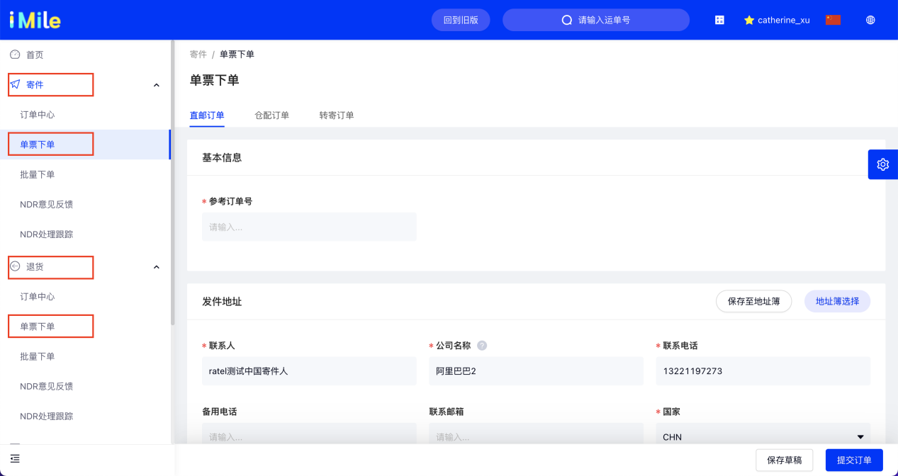

## 1. 功能说明
适合非大批量订单操作，对于单个订单，支持直接创建。

## 2. 操作流程说明
选择寄件/退货 —> 单票下单 —> 选择订单类型 —> 填写订单信息（基本信息、发件地址、收件地址、商品信息、下单信息） —> 选择【保存草稿】/ 【提交订单】

## 3. 关键节点说明
- 3.1）填写订单信息—商品信息
  * 包裹数量：默认为1，若您有多个包裹，需更改包裹数量，对应会生成多个子运单；
  * 包裹体积：默认10 cm3，若您有工具，填写更真实的体积，可提高取件速度；
  * 商品明细：填写您的商品信息，每行商品对应一类SKU，建议如实填写；对于订单类型-仓配订单，商品信息将从SKU库中选择；若您有多个商品，可点击添加商品进行添加；

- 3.2）保存草稿
  保存草稿后，会保留订单信息，不会生成实际订单。
  * 查看：可在寄件/退货—订单中心—草稿—查看订单；
  * 提交：支持批量提交草稿；
  * 编辑：支持编辑草稿；
  * 删除：支持删除草稿，删除后则不保留在系统中，请注意操作；
