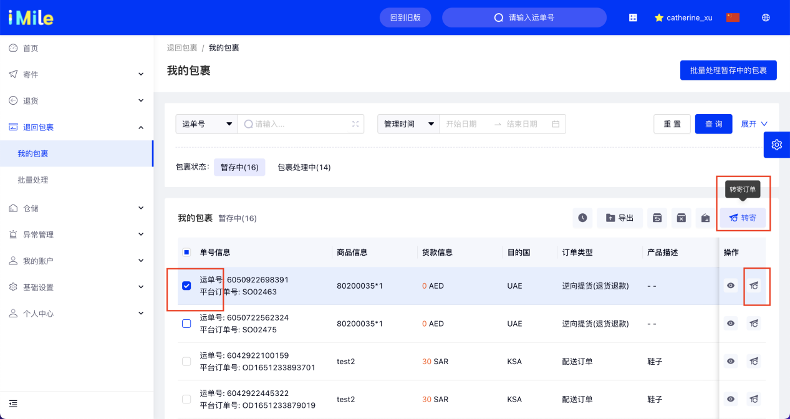

## 1. 功能说明
支持直接勾选多个需要转寄的包裹，进行转寄操作处理；

## 2. 操作流程说明
选择退回包裹 —> 我的包裹 —> 包裹状态：暂存中 —> 勾选/搜索想要转寄的运单 —> 选择转寄类型：转寄原收件人 / 转寄新收件人 —> 选择 【提交订单】

## 3. 关键节点说明
- 3.1）转寄类型：选择原收件人
  * 勾选单个订单，代表将所选订单，按原订单信息，转寄给原收件人；
  * 勾选多个订单，代表将所选订单，按原订单信息，分别转寄给对应的原收件人；

- 3.2) 转寄类型：选择新收件人
  需要填写新收件人相关信息
  * 勾选单个订单，代表将所选订单，按新订单信息，转寄给新收件人；
  * 勾选多个订单，代表将所选订单，按新订单信息，合并转寄给新收件人；
